<div align="center">
  <a href="https://bongocat.pet" target="_blank">
    
  </a>
  
  <h1>
    <a href="https://bongocat.pet" target="_blank" style="text-decoration: none; color: inherit;">BongoCat</a>
  </h1>
</div>


<!-- 项目描述 + 火箭图标 -->
<p align="center"> 
 💘C/C++ × SDL3 × OpenGL, 搅匀，捣碎！嘣~  Bongo Cat!!! 
</p>

<!-- 演示视频 -->
<div align="center" style="margin-bottom: 30px;">
  <video src="https://github.com/user-attachments/assets/75719230-9e49-4124-ae5a-8e35592c5d49
" autoplay loop style="border-radius: 8px; max-width: 800px;"></video>
</div>


> [!TIP]
> 本演示使用的模型来自[宇痕冫](https://space.bilibili.com/348616056).
>
> 🎁寻找**免费**模型？访问我们的官网: [bongocat.pet](https://bongocat.pet/models)


<p align="center">
    
  </p>

## 📥 下载

<a href="https://apps.microsoft.com/detail/9p41mlsx72xw?referrer=appbadge" target="_self" >
	
</a>

- GitHub Releases

  从 [GitHub Releases](https://github.com/vladelaina/BongoCat/releases/latest) 下载最新版本。

## 项目状态


## 许可证

BongoCat 源代码和原生运行时的许可证为 [AGPL-3.0-only](LICENSE)

默认内置模型模式（`standard`）仍采用 MIT 许可证。`resources/assets/models/standard`、`keyboard` 和 `gamepad` 中的捆绑模型资产受单独的 [MIT 许可声明](LICENSE-MIT) 管辖。该 MIT 许可证仅适用于模型资产及其附带的美术作品；它不会重新授权 BongoCat 源代码或原生运行时。


## 技术架构

> 当前原生版本基于 C/C++、SDL3 和 OpenGL 构建。下图可能看起来有点复杂，但实际上并不难理解。

### 运行时所有权与帧调度

原生运行时在所有权边界上有意进行了划分：

```text
平台输入监听器
（键盘 / 指针）
            |
            v
  C11 输入状态
  （原子边沿队列 + 合并的指针路径）
            |
            v
     主线程应用 <----- SDL3 事件
            |
            v
  模型参数、覆盖层和 UI 状态
            |
            v
  Cubism 更新 -> OpenGL 合成 -> 平台呈现
```

平台输入监听器从不直接操作模型。Windows 低级钩子、macOS Quartz 事件监听和 Linux XInput2 将带时间戳的键盘和鼠标按键转换发布到应用程序拥有的输入状态。在 Windows 上，当导入的模型请求相对移动时，通过平台指针接口对 DirectInput 进行采样；SDL3 游戏手柄事件在主线程上标准化。指针坐标使用独立的原子合并路径，因此高频运动不会取代用于按键和按钮边沿的有界队列。

每次循环迭代等待 SDL 或原生唤醒、下一个调度程序截止时间或待处理的 UI/窗口工作。然后它排空排队的事件和释放恢复，应用输入派生的参数和覆盖层状态，并使用经过的时间推进模型。在普通的宠物窗口路径中，当应用程序被标记为“脏”时，会呈现一帧；显式的预览、调整大小和捕获操作可能会请求额外的渲染。呈现是平台特定的：在 macOS 和 Linux 上使用 SDL_GL_SwapWindow，在 Windows 上，当分层呈现未激活时也使用它；活动的 Windows 分层呈现使用 UpdateLayeredWindow。

调度器不需要固定的模拟步长。启用 Cubism 后，下一个模型更新从配置的最大 FPS（默认为 60 FPS）派生，并且运行时接收自上次更新以来经过的时间。经过的时间间隔限制在 250 毫秒以内，并细分为最多八个子步骤以保证稳定性。如果更新未产生视觉变化，则除非另一个状态转换请求渲染，否则不会再次呈现普通宠物窗口。

C 运行时调用 include/bongo_cat/model.h 中声明的 C ABI，其桥接和模型实现位于 src/live2d。当启用 Cubism SDK 时，该实现为 C++17，因为 SDK 公开了 C++ API；其余原生 C 源使用 C11。Cubism SDK 类型保留在不透明的 C 句柄和 C 兼容结构后面，而当 SDK 不可用时，src/live2d/live2d_stub.c 提供诊断后端。

```mermaid
%%{init: {"flowchart": {"curve": "catmullRom", "htmlLabels": true, "nodeSpacing": 24, "rankSpacing": 38}}}%%
flowchart TB
  User(["用户输入<br/>键盘 / 鼠标 / 游戏手柄"])
  ModelSources(["外部模型源<br/>独立 .model3.json / Mver 包 / Mver 图像补丁"])
  Desktop(["桌面输出<br/>透明宠物窗口 / 偏好设置窗口"])

  subgraph Platform["平台后端"]
    direction LR
    Win["Windows<br/>Win32 钩子 / DirectInput / 分层窗口支持"]
    Mac["macOS<br/>Cocoa / ApplicationServices / Quartz 事件监听"]
    Linux["Linux<br/>X11 / XInput2 / XFixes"]
  end

  subgraph Native["BongoCat 原生运行时"]
    direction TB

    subgraph Orchestration["运行时编排 / C11"]
      direction LR
      Entry["进程入口<br/>src/main.c 调用 bongo_cat_app_run"]
      Lifecycle["应用生命周期<br/>启动 / 存储路径 / 配置 / 关闭"]
      EventLoop["SDL3 事件与帧循环<br/>等待 / 分发 / 排空输入 / 更新 / 渲染"]
      AppState[("BongoCatApp 状态<br/>设置 / 会话 / 目录 / 平台和运行时状态")]

      Entry --> Lifecycle --> EventLoop
      Lifecycle <--> AppState
      EventLoop <--> AppState
    end

    subgraph InputShell["输入与桌面外壳"]
      direction LR
      GlobalInput["全局键盘和指针捕获<br/>Win32 钩子 / Quartz 事件监听 / XInput2"]
      InputQueue[("原子输入状态<br/>有序边沿队列 / 释放边沿恢复 / 合并的指针位置")]
      Gamepad["SDL3 游戏手柄事件<br/>活动设备选择 / 按钮 / 轴"]
      InputMap["输入分发<br/>快捷键 / 模型参数 / 指针映射"]
      Shell["桌面外壳<br/>窗口 / 托盘 / 上下文菜单 / 拖拽和调整大小 / 穿透点击 / 多宠物协调"]

      GlobalInput --> InputQueue --> InputMap
      Gamepad --> InputMap
      EventLoop --> Shell
      EventLoop --> InputMap
      InputMap --> AppState
      Shell --> AppState
    end

    subgraph ModelPipeline["模型发现、适配与编目"]
      direction LR
      BuiltIn["内置模型<br/>resources/assets/models"]
      Discover["源发现<br/>独立 model3 / Mver 包 / 图像补丁"]
      Validate["验证与身份<br/>清单引用 / 有界路径 / SHA-256 摘要 / 元数据"]
      Adapt["运行时适配器生成<br/>预览资产 / 输入覆盖层 / 投影和绑定元数据"]
      Installed[("已安装包<br/>models_root / 可直接复制的 Mver 树")]
      Nearby[("运行时适配器<br/>生成在 models_root 之外 / cache_root/model-adapters")]
      Catalog["模型与行为目录<br/>模型 / 动作 / 表情 / 音效 / 特效"]

      Discover --> Validate --> Adapt
      Adapt --> Installed --> Catalog
      Adapt --> Nearby --> Catalog
      BuiltIn --> Catalog
      Catalog --> AppState
    end

    subgraph Presentation["动画、合成与 UI"]
      direction LR
      Live2DBridge["C ABI / C++17 桥接"]
      Cubism["Live2D Cubism 运行时<br/>模型 / 动作 / 表情 / 物理 / 姿势 / 参数覆盖"]
      Images["图像管线<br/>stb 解码与缩放 / Alpha 蒙版与 Mipmap / OpenGL 纹理上传"]
      Overlay["输入覆盖层运行时<br/>背景 / 指针 / 按键图像 / 特效"]
      Audio["音频播放<br/>miniaudio 引擎 / 异步文件解码"]
      Composite["OpenGL 帧合成<br/>清除和背景 / Live2D 模型 / 指针、按键和特效"]
      Preferences["Nuklear 偏好设置 UI<br/>Catime 主题 / 本地化 / 设置 / 模型管理"]
      Present["平台呈现<br/>Windows: UpdateLayeredWindow 或 GL 交换<br/>macOS 和 Linux: SDL_GL_SwapWindow"]

      Live2DBridge --> Cubism
      Cubism --> Composite --> Present
      Images --> Cubism
      Images --> Overlay --> Composite
      AppState <--> Preferences
    end

    EventLoop --> Live2DBridge
    EventLoop --> Composite
    EventLoop --> Preferences
    AppState --> Live2DBridge
    AppState --> Composite
    InputMap --> Live2DBridge
    InputMap --> Overlay
    InputMap --> Audio
    Catalog --> Live2DBridge
    Catalog --> Overlay
    Catalog --> Audio
    Shell --> Preferences
  end

  subgraph Dependencies["原生依赖"]
    direction LR
    SDL["SDL3"]
    OpenGL["OpenGL"]
    GLEW["GLEW<br/>Cubism OpenGL 函数加载"]
    CubismSDK["Live2D Cubism SDK"]
    YYJSON["yyjson"]
    STB["stb_image / stb_image_resize2 / stb_image_write"]
    Miniaudio["miniaudio"]
    Nuklear["Nuklear"]
  end

  subgraph Toolchain["构建、验证与分发"]
    direction LR
    CMake["CMake<br/>固定依赖 / 平台源 / 资产暂存与嵌入"]
    CTest["CTest<br/>核心 / i18n / UI / 应用状态 / 模型导入 / 动作状态 / Windows 捕获"]
    Audits["静态与运行时检查<br/>行策略 / 平台 API 允许列表 / 烟雾与视觉审计"]
    Packaging["分发<br/>Windows ZIP 和 NSIS / macOS ZIP / Linux TGZ / Microsoft Store MSIX"]

    CMake --> CTest
    CMake --> Audits
    CMake --> Packaging
  end

  User --> GlobalInput
  User --> Gamepad
  User --> Shell
  ModelSources --> Discover

  Win --> GlobalInput
  Mac --> GlobalInput
  Linux --> GlobalInput
  Win --> Shell
  Mac --> Shell
  Linux --> Shell
  Win --> Present
  Mac --> Present
  Linux --> Present

  Present --> Desktop
  Preferences --> Desktop

  SDL -.-> EventLoop
  SDL -.-> Gamepad
  SDL -.-> Shell
  SDL -.-> Present
  OpenGL -.-> Cubism
  OpenGL -.-> Composite
  OpenGL -.-> Preferences
  GLEW -.-> Cubism
  CubismSDK -.-> Cubism
  YYJSON -.-> Lifecycle
  YYJSON -.-> Validate
  STB -.-> Images
  Miniaudio -.-> Audio
  Nuklear -.-> Preferences

  CMake -.-> Entry
  CTest -.-> AppState
  CTest -.-> Preferences
  CTest -.-> Live2DBridge
  CTest -.-> Present
  Audits -.-> EventLoop
  Audits -.-> GlobalInput
  Audits -.-> Composite

  classDef external fill:#fff4cc,stroke:#b7791f,color:#3d2b00,stroke-width:1.5px
  classDef platform fill:#e8f1ff,stroke:#4a78b8,color:#14263d,stroke-width:1.5px
  classDef runtime fill:#ffe8f0,stroke:#d95f8d,color:#3d1725,stroke-width:1.5px
  classDef state fill:#f3eaff,stroke:#8a63c7,color:#2c1b46,stroke-width:1.5px
  classDef input fill:#e7f8ff,stroke:#3f8eaa,color:#12323d,stroke-width:1.5px
  classDef model fill:#eaf8e8,stroke:#57945a,color:#18361a,stroke-width:1.5px
  classDef render fill:#f3ecff,stroke:#8064b3,color:#281b40,stroke-width:1.5px
  classDef dependency fill:#f4f4f5,stroke:#71717a,color:#27272a,stroke-width:1.2px
  classDef tooling fill:#fff0dd,stroke:#c47b2c,color:#42270d,stroke-width:1.5px

  class User,ModelSources,Desktop external
  class Win,Mac,Linux platform
  class Entry,Lifecycle,EventLoop runtime
  class AppState,InputQueue,Installed,Nearby state
  class GlobalInput,Gamepad,InputMap,Shell input
  class BuiltIn,Discover,Validate,Adapt,Catalog model
  class Live2DBridge,Cubism,Images,Overlay,Audio,Composite,Preferences,Present render
  class SDL,OpenGL,GLEW,CubismSDK,YYJSON,STB,Miniaudio,Nuklear dependency
  class CMake,CTest,Audits,Packaging tooling

  style Native fill:#fffafd,stroke:#d95f8d,stroke-width:2px
  style Platform fill:#f8fbff,stroke:#7da1cf,stroke-width:1.5px
  style Orchestration fill:#fff7fa,stroke:#ed9eb8,stroke-width:1px
  style InputShell fill:#f5fcff,stroke:#86bfd3,stroke-width:1px
  style ModelPipeline fill:#f7fcf5,stroke:#91bd8f,stroke-width:1px
  style Presentation fill:#faf7ff,stroke:#ad98cf,stroke-width:1px
  style Dependencies fill:#fafafa,stroke:#a1a1aa,stroke-width:1px
  style Toolchain fill:#fffaf3,stroke:#dda866,stroke-width:1.5px
```



# 以下是你可能好奇的几点:

1. 为什么选择 OpenGL 而非 Vulkan


## 特别感谢❤️

<a href="https://openomy.com/vladelaina/BongoCat" target="_blank" style="display: block; width: 100%;" align="center">
  
</a>


---

<div align="center">

版权所有 © 2026 - BongoCat
作者 vladelaina
用 ❤️ 和 ⌨️ 制作

</div>

