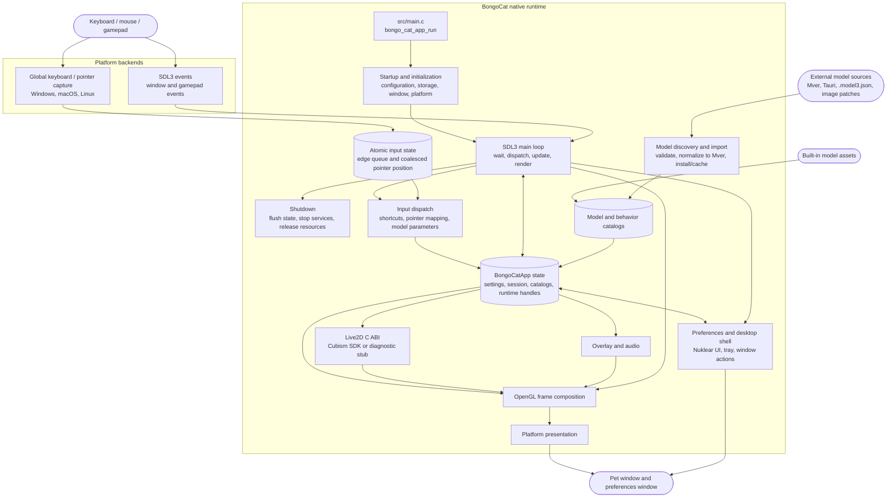

<div align="center">
  <a href="https://bongocat.pet" target="_blank">
    
  </a>
  
  <h1>
    <a href="https://bongocat.pet" target="_blank" style="text-decoration: none; color: inherit;">BongoCat</a>
  </h1>
</div>


<!-- Project Description + Rocket Icon -->
<p align="center"> 
 💘C/C++ × SDL3 × OpenGL, stir it up, mash it together! Bong~ Bongo Cat!!! 
</p>

<!-- Demo Video -->
<div align="center" style="margin-bottom: 30px;">
  <video src="https://github.com/user-attachments/assets/75719230-9e49-4124-ae5a-8e35592c5d49
" autoplay loop style="border-radius: 8px; max-width: 800px;"></video>
</div>


> [!TIP]
> The model featured in this demonstration is from [宇痕冫](https://space.bilibili.com/348616056).
>
> 🎁Looking for **free** models? Visit our official website: [bongocat.pet](https://bongocat.pet/models)


<p align="center">
    
  </p>

## 📥 Download

<a href="https://apps.microsoft.com/detail/9p41mlsx72xw?referrer=appbadge" target="_self" >
	
</a>

- GitHub Releases

  Download the latest release from [GitHub Releases](https://github.com/vladelaina/BongoCat/releases/latest).

## Project Status


## License

The BongoCat source code and native runtime are licensed under
[AGPL-3.0-only](LICENSE).

The default built-in model mode (`standard`) remains MIT-licensed. The
bundled model assets in `resources/assets/models/standard`, `keyboard`, and
`gamepad` are covered by the separate [MIT license notice](LICENSE-MIT).
That MIT license applies to the model assets and their accompanying artwork
only; it does not relicense the BongoCat source code or native runtime.


## Technical Architecture

> The current native version is built on C/C++, SDL3, and OpenGL. The diagram below focuses on the runtime data flow; build and packaging details live in CMake.

### Runtime ownership and frame scheduling

Each process owns one `BongoCatApp` and one main-thread event and render loop.
Platform listeners stop at the input boundary:

```text
Platform listeners
(keyboard / pointer)
            |
            v
  C11 input state
  (atomic edge queue + coalesced pointer position)
            |
            v
  main-thread application <----- SDL3 events
            |
            v
  model parameters, overlay, and UI state
            |
            v
  model update -> OpenGL composition -> platform presentation
```

The Windows low-level hooks, macOS Quartz event tap, and Linux XInput2 listener
run outside the main loop. They publish timestamped key and mouse-button edges
to the bounded atomic queue and publish pointer coordinates through a separate
coalescing slot; a successful publish pushes a native SDL wake event. This
keeps high-frequency motion from displacing ordered key and button edges. On
Windows, DirectInput is used only through the platform pointer interface when a
model requests relative movement. SDL3 window, preferences, and gamepad events
are handled on the main thread, where gamepad events are normalized before they
reach model parameters or shortcuts. No platform listener calls Live2D,
overlay, or UI code directly.

`bongo_cat_app_run` handles update-shutdown and secondary-process arguments,
enforces single-instance ownership for the primary process, allocates the
application state, runs initialization, enters `bongo_cat_app_loop`, and then
flushes state and destroys resources in a defined order. Initialization loads
configuration and storage paths, locates assets, creates the SDL/OpenGL pet
window, initializes the platform backend, creates the Live2D, overlay, and
audio services, scans the built-in/installed/nearby model sources, and loads a
usable model. `BongoCatApp` owns settings, session state, model and behavior
catalogs, platform handles, and runtime service handles.

Installed model packages use Mver as the canonical format. The import workflow
resolves a selected file or directory, discovers and validates candidates,
fingerprints package identity, converts Tauri sources to Mver, applies image
patches, and commits the normalized package under `models_root`. It then
generates the runtime adapter and refreshes the catalogs. Nearby sources are
discovered without installing their source tree; their adapters and inspection
results are cached outside `models_root` under `cache_root`.

Each main-loop iteration waits for SDL/native wakeups or the earliest pending
frame, UI, animation, or pointer-hit deadline (with a maximum wait of 250 ms).
It dispatches queued SDL events, drains the atomic input queue and release
recovery, updates window and model-refresh state, and applies input-derived
parameters. With Cubism enabled, the model deadline follows
`settings.model.max_fps` (60 FPS by default); diagnostic builds use a 100 ms
fallback interval. The elapsed model time is capped at 250 ms and split into up
to eight substeps, targeting no more than 1/30 s per substep.

The normal pet path renders only when the window is visible, not minimized, and
marked dirty. A frame clears the background, draws the model, and composites
pointer, key, and effect overlays before calling the platform presenter.
Preview operations can request immediate renders, while capture renders may
skip presentation. macOS and Linux swap the SDL OpenGL window directly.
Windows swaps directly when layered presentation is inactive and otherwise
reads back the frame for `UpdateLayeredWindow`. The preferences UI owns a
separate SDL/OpenGL window and is rendered and presented independently from
the pet window.

The C runtime calls the ABI declared in `include/bongo_cat/model.h`. The Live2D
bridge and Cubism implementation live in `src/live2d` and use C++17 only when
the Cubism SDK is enabled; the rest of the native runtime uses C11. Cubism
types remain behind opaque C handles, while `src/live2d/live2d_stub.c` provides
the diagnostic backend when the SDK is unavailable.




# Here are a few things you might be curious about:

1. Why OpenGL instead of Vulkan


## Special Thanks❤️

<a href="https://openomy.com/vladelaina/BongoCat" target="_blank" style="display: block; width: 100%;" align="center">
  
</a>


---

<div align="center">

Copyright © 2026 - **BongoCat**\
By vladelaina\
Made with ❤️ & ⌨️

</div>
