> [!TIP]
> The model featured in this demonstration is from [宇痕冫](https://www.bilibili.com/video/BV1ZVK56HECF).

<p align="center">
    
  </p>

## Project Status


## License

The BongoCat source code and native runtime are licensed under
[AGPL-3.0-only](LICENSE).

The default built-in model mode (`standard`) remains MIT-licensed. The
bundled model assets in `resources/assets/models/standard`, `keyboard`, and
`gamepad` are covered by the separate [MIT license notice](LICENSE-MIT).
That MIT license applies to the model assets and their accompanying artwork
only; it does not relicense the BongoCat source code or native runtime.


## Technical Architecture

> The current native version is built on C/C++, SDL3, and OpenGL. The diagram below may look a little complicated, but it’s actually not difficult to understand.

### Runtime ownership and frame scheduling

The native runtime is intentionally split at ownership boundaries:

```text
Platform input listeners
(keyboard / pointer)
            |
            v
  C11 input state
  (atomic edge queue + coalesced pointer path)
            |
            v
     main-thread application <----- SDL3 events
            |
            v
  model parameters, overlay, and UI state
            |
            v
  Cubism update -> OpenGL composition -> platform presentation
```

Platform input listeners never manipulate a model directly. Windows low-level
hooks, the macOS Quartz event tap, and Linux XInput2 publish timestamped
keyboard and mouse-button transitions to application-owned input state. On
Windows, DirectInput is sampled through the platform pointer interface when an
imported model requests relative movement; SDL3 gamepad events are normalized
on the main thread. Pointer coordinates use a separate atomic coalescing path,
so high-frequency motion does not displace the bounded queue used for key and
button edges.

Each loop iteration waits for SDL or native wakeups, the next scheduler
deadline, or pending UI/window work. It then drains queued events and release
recovery, applies input-derived parameters and overlay state, and advances the
model with elapsed time. In the normal pet-window path, a frame is presented
when the application is marked dirty; explicit preview, resize, and capture
operations may request additional renders. Presentation is platform-specific:
`SDL_GL_SwapWindow` is used on macOS and Linux, and on Windows when layered
presentation is inactive; active Windows layered presentation uses
`UpdateLayeredWindow`.

The scheduler does not require a fixed simulation step. With Cubism enabled,
the next model update is derived from the configured maximum FPS (defaulting to
60 FPS), and the runtime receives the elapsed time since the previous update.
Elapsed gaps are capped at 250 ms and subdivided into at most eight substeps
for stability. If an update produces no visual change, the normal pet window
is not presented again unless another state transition requests a render.

The C runtime calls the C ABI declared in `include/bongo_cat/model.h`, whose
bridge and model implementation live in `src/live2d`. When the Cubism SDK is
enabled, that implementation is C++17 because the SDK exposes a C++ API; the
rest of the native C sources use C11. Cubism SDK types stay behind opaque C
handles and C-compatible structures, while `src/live2d/live2d_stub.c` provides
the diagnostic backend when the SDK is unavailable.

```mermaid
%%{init: {"flowchart": {"curve": "catmullRom", "htmlLabels": true, "nodeSpacing": 24, "rankSpacing": 38}}}%%
flowchart TB
  User(["User Input<br/>Keyboard / Mouse / Gamepad"])
  ModelSources(["External Model Sources<br/>Standalone .model3.json / Mver package / Mver image patch"])
  Desktop(["Desktop Output<br/>Transparent pet window / Preferences window"])

  subgraph Platform["Platform Backends"]
    direction LR
    Win["Windows<br/>Win32 hooks / DirectInput / layered-window support"]
    Mac["macOS<br/>Cocoa / ApplicationServices / Quartz event tap"]
    Linux["Linux<br/>X11 / XInput2 / XFixes"]
  end

  subgraph Native["BongoCat Native Runtime"]
    direction TB

    subgraph Orchestration["Runtime Orchestration / C11"]
      direction LR
      Entry["Process Entry<br/>src/main.c calls bongo_cat_app_run"]
      Lifecycle["Application Lifecycle<br/>startup / storage paths / configuration / shutdown"]
      EventLoop["SDL3 Event and Frame Loop<br/>wait / dispatch / drain input / update / render"]
      AppState[("BongoCatApp State<br/>settings / session / catalogs / platform and runtime state")]

      Entry --> Lifecycle --> EventLoop
      Lifecycle <--> AppState
      EventLoop <--> AppState
    end

    subgraph InputShell["Input and Desktop Shell"]
      direction LR
      GlobalInput["Global Keyboard and Pointer Capture<br/>Win32 hooks / Quartz event tap / XInput2"]
      InputQueue[("Atomic Input State<br/>ordered edge queue / release-edge recovery / coalesced pointer position")]
      Gamepad["SDL3 Gamepad Events<br/>active-device selection / buttons / axes"]
      InputMap["Input Dispatch<br/>shortcuts / model parameters / pointer mapping"]
      Shell["Desktop Shell<br/>window / tray / context menu / drag and resize / click-through / multi-pet coordination"]

      GlobalInput --> InputQueue --> InputMap
      Gamepad --> InputMap
      EventLoop --> Shell
      EventLoop --> InputMap
      InputMap --> AppState
      Shell --> AppState
    end

    subgraph ModelPipeline["Model Discovery, Adaptation, and Cataloging"]
      direction LR
      BuiltIn["Built-in Models<br/>resources/assets/models"]
      Discover["Source Discovery<br/>standalone model3 / Mver package / image patch"]
      Validate["Validation and Identity<br/>manifest references / bounded paths / SHA-256 digest / metadata"]
      Adapt["Runtime Adapter Generation<br/>preview assets / input overlays / projection and binding metadata"]
      Installed[("Installed Packages<br/>models_root / directly copyable Mver trees")]
      Nearby[("Runtime Adapters<br/>generated outside models_root / cache_root/model-adapters")]
      Catalog["Model and Behavior Catalogs<br/>models / motions / expressions / sounds / effects"]

      Discover --> Validate --> Adapt
      Adapt --> Installed --> Catalog
      Adapt --> Nearby --> Catalog
      BuiltIn --> Catalog
      Catalog --> AppState
    end

    subgraph Presentation["Animation, Composition, and UI"]
      direction LR
      Live2DBridge["C ABI / C++17 Bridge"]
      Cubism["Live2D Cubism Runtime<br/>model / motion / expression / physics / pose / parameter overrides"]
      Images["Image Pipeline<br/>stb decode and resize / alpha masks and mipmaps / OpenGL texture upload"]
      Overlay["Input Overlay Runtime<br/>background / pointer / key images / effects"]
      Audio["Audio Playback<br/>miniaudio engine / asynchronous file decoding"]
      Composite["OpenGL Frame Composition<br/>clear and background / Live2D model / pointer, keys, and effects"]
      Preferences["Nuklear Preferences UI<br/>Catime theme / localization / settings / model management"]
      Present["Platform Presentation<br/>Windows: UpdateLayeredWindow or GL swap<br/>macOS and Linux: SDL_GL_SwapWindow"]

      Live2DBridge --> Cubism
      Cubism --> Composite --> Present
      Images --> Cubism
      Images --> Overlay --> Composite
      AppState <--> Preferences
    end

    EventLoop --> Live2DBridge
    EventLoop --> Composite
    EventLoop --> Preferences
    AppState --> Live2DBridge
    AppState --> Composite
    InputMap --> Live2DBridge
    InputMap --> Overlay
    InputMap --> Audio
    Catalog --> Live2DBridge
    Catalog --> Overlay
    Catalog --> Audio
    Shell --> Preferences
  end

  subgraph Dependencies["Native Dependencies"]
    direction LR
    SDL["SDL3"]
    OpenGL["OpenGL"]
    GLEW["GLEW<br/>Cubism OpenGL function loading"]
    CubismSDK["Live2D Cubism SDK"]
    YYJSON["yyjson"]
    STB["stb_image / stb_image_resize2 / stb_image_write"]
    Miniaudio["miniaudio"]
    Nuklear["Nuklear"]
  end

  subgraph Toolchain["Build, Verification, and Distribution"]
    direction LR
    CMake["CMake<br/>pinned dependencies / platform sources / asset staging and embedding"]
    CTest["CTest<br/>core / i18n / UI / app state / model import / motion state / Windows capture"]
    Audits["Static and Runtime Checks<br/>line policy / platform API allowlist / smoke and visual audits"]
    Packaging["Distribution<br/>Windows ZIP and NSIS / macOS ZIP / Linux TGZ / Microsoft Store MSIX"]

    CMake --> CTest
    CMake --> Audits
    CMake --> Packaging
  end

  User --> GlobalInput
  User --> Gamepad
  User --> Shell
  ModelSources --> Discover

  Win --> GlobalInput
  Mac --> GlobalInput
  Linux --> GlobalInput
  Win --> Shell
  Mac --> Shell
  Linux --> Shell
  Win --> Present
  Mac --> Present
  Linux --> Present

  Present --> Desktop
  Preferences --> Desktop

  SDL -.-> EventLoop
  SDL -.-> Gamepad
  SDL -.-> Shell
  SDL -.-> Present
  OpenGL -.-> Cubism
  OpenGL -.-> Composite
  OpenGL -.-> Preferences
  GLEW -.-> Cubism
  CubismSDK -.-> Cubism
  YYJSON -.-> Lifecycle
  YYJSON -.-> Validate
  STB -.-> Images
  Miniaudio -.-> Audio
  Nuklear -.-> Preferences

  CMake -.-> Entry
  CTest -.-> AppState
  CTest -.-> Preferences
  CTest -.-> Live2DBridge
  CTest -.-> Present
  Audits -.-> EventLoop
  Audits -.-> GlobalInput
  Audits -.-> Composite

  classDef external fill:#fff4cc,stroke:#b7791f,color:#3d2b00,stroke-width:1.5px
  classDef platform fill:#e8f1ff,stroke:#4a78b8,color:#14263d,stroke-width:1.5px
  classDef runtime fill:#ffe8f0,stroke:#d95f8d,color:#3d1725,stroke-width:1.5px
  classDef state fill:#f3eaff,stroke:#8a63c7,color:#2c1b46,stroke-width:1.5px
  classDef input fill:#e7f8ff,stroke:#3f8eaa,color:#12323d,stroke-width:1.5px
  classDef model fill:#eaf8e8,stroke:#57945a,color:#18361a,stroke-width:1.5px
  classDef render fill:#f3ecff,stroke:#8064b3,color:#281b40,stroke-width:1.5px
  classDef dependency fill:#f4f4f5,stroke:#71717a,color:#27272a,stroke-width:1.2px
  classDef tooling fill:#fff0dd,stroke:#c47b2c,color:#42270d,stroke-width:1.5px

  class User,ModelSources,Desktop external
  class Win,Mac,Linux platform
  class Entry,Lifecycle,EventLoop runtime
  class AppState,InputQueue,Installed,Nearby state
  class GlobalInput,Gamepad,InputMap,Shell input
  class BuiltIn,Discover,Validate,Adapt,Catalog model
  class Live2DBridge,Cubism,Images,Overlay,Audio,Composite,Preferences,Present render
  class SDL,OpenGL,GLEW,CubismSDK,YYJSON,STB,Miniaudio,Nuklear dependency
  class CMake,CTest,Audits,Packaging tooling

  style Native fill:#fffafd,stroke:#d95f8d,stroke-width:2px
  style Platform fill:#f8fbff,stroke:#7da1cf,stroke-width:1.5px
  style Orchestration fill:#fff7fa,stroke:#ed9eb8,stroke-width:1px
  style InputShell fill:#f5fcff,stroke:#86bfd3,stroke-width:1px
  style ModelPipeline fill:#f7fcf5,stroke:#91bd8f,stroke-width:1px
  style Presentation fill:#faf7ff,stroke:#ad98cf,stroke-width:1px
  style Dependencies fill:#fafafa,stroke:#a1a1aa,stroke-width:1px
  style Toolchain fill:#fffaf3,stroke:#dda866,stroke-width:1.5px
```




# Here are a few things you might be curious about:

1. Why OpenGL instead of Vulkan


## Special Thanks❤️

<a href="https://openomy.com/vladelaina/BongoCat" target="_blank" style="display: block; width: 100%;" align="center">
  
</a>


---

<div align="center">

Copyright © 2026 - **BongoCat**\
By vladelaina\
Made with ❤️ & ⌨️

</div>

