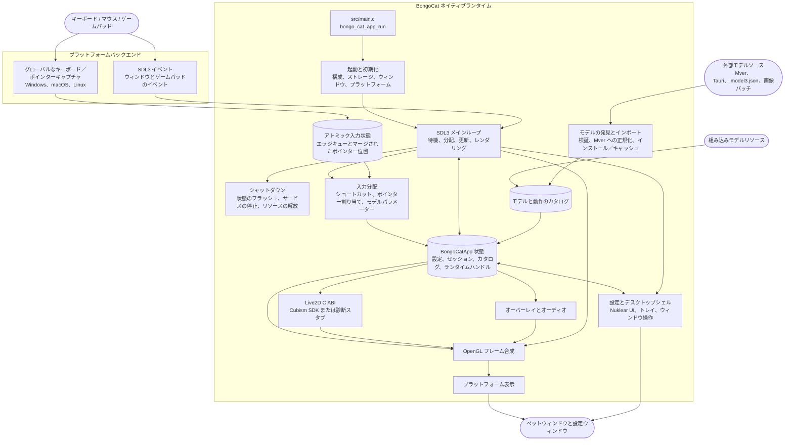

<div align="center">
  <a href="https://bongocat.pet" target="_blank">
    
  </a>
  <h1><a href="https://bongocat.pet" target="_blank">BongoCat</a></h1>
</div>

<p align="center">💘 C/C++ × SDL3 × OpenGL、ぜんぶ混ぜて、思いっきり叩こう！Bong~ Bongo Cat!!!</p>
<p align="center">
  言語を選択 ❯ <a href="https://github.com/vladelaina/BongoCat/blob/main/README.md">English</a> • <a href="https://github.com/vladelaina/BongoCat/blob/main/docs/README.zh-CN.md">简体中文</a> • <a href="https://github.com/vladelaina/BongoCat/blob/main/docs/README.zh-Hant.md">繁體中文</a> • <a href="https://github.com/vladelaina/BongoCat/blob/main/docs/README.fr-FR.md">Français</a> • <a href="https://github.com/vladelaina/BongoCat/blob/main/docs/README.de-DE.md">Deutsch</a> • <strong>日本語</strong> • <a href="https://github.com/vladelaina/BongoCat/blob/main/docs/README.ko-KR.md">한국어</a> • <a href="https://github.com/vladelaina/BongoCat/blob/main/docs/README.pt-BR.md">Português</a> • <a href="https://github.com/vladelaina/BongoCat/blob/main/docs/README.ru-RU.md">Русский</a> • <a href="https://github.com/vladelaina/BongoCat/blob/main/docs/README.es-ES.md">Español</a>
</p>

<div align="center"><video src="https://github.com/user-attachments/assets/75719230-9e49-4124-ae5a-8e35592c5d49" autoplay loop style="border-radius: 8px; max-width: 800px;"></video></div>

> [!TIP]
> デモで使用しているモデルは [宇痕冫](https://space.bilibili.com/348616056) によるものです。
>
> 🎁 **無料**モデルをお探しですか？公式サイトへどうぞ：[bongocat.pet](https://bongocat.pet/models)

<p align="center"></p>

## 📥 ダウンロード

<a href="https://apps.microsoft.com/detail/9p41mlsx72xw?referrer=appbadge" target="_self"></a>

- GitHub Releases

  最新版は [GitHub Releases](https://github.com/vladelaina/BongoCat/releases/latest) からダウンロードできます。

## 🛠️ ソースコードからビルド

BongoCat は CMake を使用し、C11 コンパイラ、C++17 コンパイラ、CMake 3.24 以降、デスクトップ用 OpenGL 開発ファイルが必要です。デフォルトでは SDL3、yyjson、stb、miniaudio、Nuklear が構成時に自動的にダウンロードされるため、初回構成にはネットワーク接続が必要です。

プロジェクトのルートディレクトリ（`CMakeLists.txt` を含むディレクトリ）で以下のコマンドを実行してください。

### 📋 プラットフォーム別の前提条件

- **Windows：** Visual Studio 2022（「C++ によるデスクトップ開発」ワークロードをインストール）と CMake。MSVC ジェネレーターを使用してください。MinGW は診断バックエンドをビルドできますが、Cubism SDK には対応していません。
- **macOS：** Xcode Command Line Tools、CMake、Ninja。ターゲットアーキテクチャがホストの既定と異なる場合は、`CMAKE_OSX_ARCHITECTURES` で指定してください。
- **Linux（Debian/Ubuntu）：** GCC または Clang、Ninja、および OpenGL/X11 ヘッダー：

  ```bash
  sudo apt-get update
  sudo apt-get install -y build-essential cmake ninja-build \
    libgl1-mesa-dev libx11-dev libxi-dev libxfixes-dev
  ```

### 🔧 構成とビルド

Linux と macOS では、Ninja のような単一構成ジェネレーターを使用してください：

```bash
cmake -S . -B build -G Ninja \
  -DCMAKE_BUILD_TYPE=Release \
  -DBONGO_CAT_FETCH_DEPS=ON
cmake --build build --parallel
```

Windows では、Visual Studio 2022 の開発者コマンドプロンプト（または MSVC が利用可能なシェル）からコマンドを実行してください：

```powershell
cmake -S . -B build -G "Visual Studio 17 2022" -A x64 `
  -DBONGO_CAT_FETCH_DEPS=ON
cmake --build build --config Release --parallel
```

実行ファイルは、Linux では `build/BongoCat`、macOS では `build/BongoCat.app/Contents/MacOS/BongoCat`、Visual Studio ビルドの Windows では `build/Release/BongoCat.exe` に生成されます。

### 🧪 テスト

CTest ターゲットはデフォルトで有効です。ビルド後に以下を実行してください：

```bash
ctest --test-dir build --output-on-failure
```

Visual Studio のようなマルチ構成ジェネレーターでは、ビルド構成を明示的に指定してください：

```powershell
ctest --test-dir build -C Release --output-on-failure
```

### 🎭 Live2D / Cubism SDK（オプション）

Cubism SDK が見つからない場合、CMake は警告を出して診断バックエンドをビルドします。このバックエンドは起動とプラットフォーム診断用で、Live2D モデルのレンダリングは提供しません。完全なランタイムをビルドするには、互換性のある Cubism SDK for Native をインストールし、`vendor/CubismSdkForNative` に配置するか、パスを明示的に指定してください：

```bash
cmake -S . -B build -G Ninja \
  -DCMAKE_BUILD_TYPE=Release \
  -DBONGO_CAT_CUBISM_SDK=/path/to/CubismSdkForNative \
  -DBONGO_CAT_REQUIRE_CUBISM=ON
```

SDK には Core ライブラリ、Framework のソース、`cmake/Cubism.cmake` が期待する構成の OpenGL GLEW サードパーティディレクトリが含まれている必要があります。Windows の Cubism ビルドには Visual Studio 2022 が必要です。`BONGO_CAT_REQUIRE_CUBISM=ON` を設定すると、SDK が利用できない場合に構成を失敗させ、診断バックエンドを黙って選択しなくなります。

### ⚙️ CMake オプション

| オプション | デフォルト値 | 説明 |
| --- | --- | --- |
| `BONGO_CAT_FETCH_DEPS` | `ON` | CMake の `FetchContent` を使用して固定バージョンのサードパーティ依存関係をダウンロードします。SDL3、yyjson、stb、miniaudio、Nuklear がすでに CMake で利用できる場合にのみ `OFF` に設定してください。 |
| `BONGO_CAT_CUBISM_SDK` | `vendor/CubismSdkForNative` | Cubism SDK for Native のパス。 |
| `BONGO_CAT_REQUIRE_CUBISM` | `OFF` | SDK が利用できない場合に構成を失敗させます。 |
| `BONGO_CAT_WARNINGS_AS_ERRORS` | `OFF` | ネイティブコンパイラの警告をエラーとして扱います。 |

オフラインビルドでは `BONGO_CAT_FETCH_DEPS=OFF` に設定し、SDL3（`SDL3-static` を含む）と yyjson の CMake パッケージ構成を提供してください。stb、Nuklear、miniaudio を自動検出できない場合は、そのインクルードディレクトリも指定してください：

```bash
cmake -S . -B build -G Ninja \
  -DCMAKE_BUILD_TYPE=Release \
  -DBONGO_CAT_FETCH_DEPS=OFF \
  -DBONGO_CAT_STB_INCLUDE_DIR=/path/to/stb \
  -DBONGO_CAT_NUKLEAR_INCLUDE_DIR=/path/to/nuklear \
  -DBONGO_CAT_MINIAUDIO_INCLUDE_DIR=/path/to/miniaudio
```

## 📌 プロジェクトの状態


## 📜 ライセンス

BongoCat のソースコードとネイティブランタイムは [AGPL-3.0-only](../LICENSE) ライセンスの下で提供されます。

既定の組み込みモデルモード（`standard`）は引き続き MIT ライセンスです。`resources/assets/models/standard`、`keyboard`、`gamepad` に同梱されているモデルリソースは、別途の [MIT ライセンス宣言](../LICENSE-MIT) の対象です。この MIT ライセンスはモデルリソースと付随するアートワークにのみ適用され、BongoCat のソースコードやネイティブランタイムのライセンスは変更されません。

## 🧭 技術アーキテクチャ

現在のネイティブ版は C/C++、SDL3、OpenGL で構築されています。以下の図はランタイムのデータフローを重点的に示しています。ビルドとパッケージングの詳細は CMake ファイルを参照してください。

### 🔄 ランタイムの所有権とフレームスケジューリング

各プロセスは `BongoCatApp` インスタンスと、メインスレッドのイベント／レンダリングループを 1 つ持ちます。プラットフォームリスナーは入力境界で停止します：

```text
プラットフォームリスナー（キーボード／ポインター）
            |
            v
  C11 入力状態（アトミックエッジキュー＋マージされたポインター位置）
            |
            v
  メインスレッドのアプリケーション <----- SDL3 イベント
            |
            v
  モデルパラメーター、オーバーレイ、UI 状態
            |
            v
  モデル更新 -> OpenGL 合成 -> プラットフォーム表示
```

Windows の低レベルフック、macOS の Quartz イベントタップ、Linux の XInput2 リスナーはメインループの外で実行されます。これらはタイムスタンプ付きのキー押下とマウスボタンのエッジを有界アトミックキューに公開し、独立したマージスロットでポインター座標を公開します。公開に成功するとネイティブの SDL ウェイクイベントがプッシュされ、高頻度の移動イベントが順序付けられたキーやボタンのエッジを押し出さないようにします。Windows では、モデルが相対移動を要求した場合にのみ、プラットフォームのポインターインターフェースを通じて DirectInput が使用されます。SDL3 のウィンドウ、設定、ゲームパッドイベントはメインスレッドで処理され、ゲームパッドイベントはモデルパラメーターやショートカットに渡す前に正規化されます。どのプラットフォームリスナーも Live2D、オーバーレイ、UI コードを直接呼び出しません。

`bongo_cat_app_run` は更新、シャットダウン、二次プロセスのパラメーターを処理し、メインプロセスの単一インスタンス所有権を強制し、アプリケーション状態を割り当て、初期化を実行し、`bongo_cat_app_loop` に入り、その後定義された順序で状態をフラッシュしてリソースを破棄します。初期化では設定とストレージパスを読み込み、リソースを特定し、SDL/OpenGL ペットウィンドウを作成し、プラットフォームバックエンドを初期化し、Live2D／オーバーレイ／オーディオサービスを作成し、組み込み／インストール済み／近隣のモデルソースをスキャンし、利用可能なモデルを読み込みます。`BongoCatApp` は設定、セッション状態、モデルと動作のカタログ、プラットフォームハンドル、ランタイムサービスのハンドルを保持します。

インストール済みのモデルパッケージは Mver を正規形式として使用します。インポート処理は選択したファイルまたはディレクトリを解析し、候補を発見・検証し、パッケージの ID フィンガープリントを生成し、Tauri ソースを Mver に変換し、画像パッチを適用し、正規化されたパッケージを `models_root` にコミットします。その後、ランタイムアダプターが生成され、カタログが更新されます。近隣ソースはソースツリーをインストールせずに発見されるだけです。そのアダプターと検査結果は `models_root` の外の `cache_root` にキャッシュされます。

メインループの各反復は、SDL／ネイティブのウェイクイベント、または最も早いフレーム、UI、アニメーション、ポインターのヒット期限（最大 250 ミリ秒）を待ちます。ループはキューに入った SDL イベントを分配し、アトミック入力キューを空にして解放回復を実行し、ウィンドウとモデルの更新状態を更新してから、入力パラメーターを適用します。Cubism が有効な場合、モデルの期限は `settings.model.max_fps`（既定 60 FPS）に従います。診断ビルドは 100 ミリ秒のフォールバック間隔を使用します。モデルの経過時間は最大 250 ミリ秒でカウントされ、それぞれ 1/30 秒以下を目標とする最大 8 つのサブステップに分割されます。

通常のペットパスは、ウィンドウが表示され、最小化されておらず、ダーティとマークされている場合にのみレンダリングされます。各フレームはまず背景をクリアし、モデルを描画してから、ポインター、キー、エフェクトのオーバーレイを合成し、最後にプラットフォームのプレゼンターを呼び出します。プレビュー操作は即時レンダリングを要求でき、スクリーンショットのレンダリングは表示をスキップできます。macOS と Linux は SDL OpenGL ウィンドウを直接交換します。Windows はレイヤード表示が有効でない場合は直接交換し、それ以外はフレームバッファを読み取って `UpdateLayeredWindow` を呼び出します。設定 UI は独自の SDL/OpenGL ウィンドウを持ち、個別にレンダリング・表示されます。

C ランタイムは `include/bongo_cat/model.h` で宣言されている ABI を呼び出します。Live2D ブリッジと Cubism 実装は `src/live2d` にあり、Cubism SDK が有効な場合のみ C++17 を使用します。残りのネイティブランタイムは C11 を使用します。Cubism 型は不透明な C ハンドルの背後に保持されます。SDK が利用できない場合は、`src/live2d/live2d_stub.c` が診断バックエンドを提供します。



## ❓ よくある質問

### 🔒 BongoCat はキーボードやマウスの入力を記録しますか？

いいえ。BongoCat はキーボードとマウスの入力をローカルで処理し、アニメーションとショートカットを駆動します。キーストローク、マウス操作、その他の操作データを記録したりアップロードしたりすることはありません。構成もローカルのみに保存され、アプリには広告、分析ツール、ユーザー追跡コードは含まれていません。更新チェックの実行時には公開バージョンのメタデータのみが要求され、入力、構成、使用データは送信されません。

### 🖼️ Vulkan ではなく OpenGL を使うのはなぜですか？

Vulkan が悪いからではなく、BongoCat にはその複雑さが必要ないからです。このアプリは主に Live2D モデル 1 つ、少数の UI レイヤー、透明なデスクトップウィンドウをレンダリングします。OpenGL で十分にまかなえ、SDL3 や Cubism の OpenGL レンダラーとも自然に連携します。Vulkan への移行は 3 つのデスクトッププラットフォームでより多くのレンダリング・同期コードを維持することになり、ユーザーにとっての明確なメリットはありません。BongoCat の現在のワークロードでは、OpenGL によってレンダラーがより軽量で、デバッグや保守も容易になり、必要なパフォーマンスも引き続き提供できます。

## 🙏 スペシャルサンクス

<a href="https://openomy.com/vladelaina/BongoCat" target="_blank"></a>

<div align="center">
著作権 © 2026 - **BongoCat**<br>
By vladelaina<br>
Made with ❤️ & ⌨️
</div>
