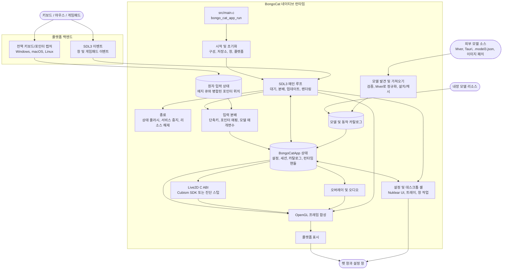

<div align="center">
  <a href="https://bongocat.pet" target="_blank">
    
  </a>
  <h1><a href="https://bongocat.pet" target="_blank">BongoCat</a></h1>
</div>

<p align="center">💘 C/C++ × SDL3 × OpenGL, 다 섞어서 마음껏 두드려 보자! Bong~ Bongo Cat!!!</p>
<p align="center">
  언어 선택 ❯ <a href="https://github.com/vladelaina/BongoCat/blob/main/README.md">English</a> • <a href="https://github.com/vladelaina/BongoCat/blob/main/docs/README.zh-CN.md">简体中文</a> • <a href="https://github.com/vladelaina/BongoCat/blob/main/docs/README.zh-Hant.md">繁體中文</a> • <a href="https://github.com/vladelaina/BongoCat/blob/main/docs/README.fr-FR.md">Français</a> • <a href="https://github.com/vladelaina/BongoCat/blob/main/docs/README.de-DE.md">Deutsch</a> • <a href="https://github.com/vladelaina/BongoCat/blob/main/docs/README.ja-JP.md">日本語</a> • <strong>한국어</strong> • <a href="https://github.com/vladelaina/BongoCat/blob/main/docs/README.pt-BR.md">Português</a> • <a href="https://github.com/vladelaina/BongoCat/blob/main/docs/README.ru-RU.md">Русский</a> • <a href="https://github.com/vladelaina/BongoCat/blob/main/docs/README.es-ES.md">Español</a>
</p>

<div align="center"><video src="https://github.com/user-attachments/assets/75719230-9e49-4124-ae5a-8e35592c5d49" autoplay loop style="border-radius: 8px; max-width: 800px;"></video></div>

> [!TIP]
> 데모에 사용된 모델은 [宇痕冫](https://space.bilibili.com/348616056) 님의 것입니다.
>
> 🎁 **무료** 모델을 찾고 계신가요? 공식 웹사이트를 방문하세요: [bongocat.pet](https://bongocat.pet/models)

<p align="center"></p>

## 📥 다운로드

<a href="https://apps.microsoft.com/detail/9p41mlsx72xw?referrer=appbadge" target="_self"></a>

- GitHub Releases

  최신 버전은 [GitHub Releases](https://github.com/vladelaina/BongoCat/releases/latest)에서 다운로드하세요.

## 🛠️ 소스 코드에서 빌드

BongoCat은 CMake를 사용하며 C11 컴파일러, C++17 컴파일러, CMake 3.24 이상, 데스크톱용 OpenGL 개발 파일이 필요합니다. 기본적으로 SDL3, yyjson, stb, miniaudio, Nuklear는 구성 단계에서 자동으로 다운로드되므로 첫 구성에는 네트워크 연결이 필요합니다.

프로젝트 루트 디렉터리(`CMakeLists.txt`가 포함된 디렉터리)에서 다음 명령을 실행하세요.

### 📋 플랫폼별 사전 요구 사항

- **Windows:** Visual Studio 2022(‘C++를 사용한 데스크톱 개발’ 워크로드 설치)와 CMake. MSVC 생성기를 사용하세요. MinGW는 진단 백엔드를 빌드할 수 있지만 Cubism SDK는 지원하지 않습니다.
- **macOS:** Xcode Command Line Tools, CMake, Ninja. 대상 아키텍처가 호스트 기본 아키텍처와 다른 경우 `CMAKE_OSX_ARCHITECTURES`로 지정하세요.
- **Linux(Debian/Ubuntu):** GCC 또는 Clang, Ninja, OpenGL/X11 헤더:

  ```bash
  sudo apt-get update
  sudo apt-get install -y build-essential cmake ninja-build \
    libgl1-mesa-dev libx11-dev libxi-dev libxfixes-dev
  ```

### 🔧 구성 및 빌드

Linux와 macOS에서는 Ninja 같은 단일 구성 생성기를 사용하세요:

```bash
cmake -S . -B build -G Ninja \
  -DCMAKE_BUILD_TYPE=Release \
  -DBONGO_CAT_FETCH_DEPS=ON
cmake --build build --parallel
```

Windows에서는 Visual Studio 2022 개발자 명령 프롬프트(또는 MSVC를 사용할 수 있는 셸)에서 명령을 실행하세요:

```powershell
cmake -S . -B build -G "Visual Studio 17 2022" -A x64 `
  -DBONGO_CAT_FETCH_DEPS=ON
cmake --build build --config Release --parallel
```

실행 파일은 Linux의 `build/BongoCat`, macOS의 `build/BongoCat.app/Contents/MacOS/BongoCat`, Visual Studio 빌드의 Windows에서는 `build/Release/BongoCat.exe`에 생성됩니다.

### 🧪 테스트

CTest 대상은 기본적으로 활성화되어 있습니다. 빌드 후 다음을 실행하세요:

```bash
ctest --test-dir build --output-on-failure
```

Visual Studio 같은 다중 구성 생성기에서는 빌드 구성을 명시적으로 지정하세요:

```powershell
ctest --test-dir build -C Release --output-on-failure
```

### 🎭 Live2D / Cubism SDK(선택 사항)

Cubism SDK를 찾을 수 없으면 CMake는 경고를 표시하고 진단 백엔드를 빌드합니다. 이 백엔드는 시작 및 플랫폼 진단용이며 Live2D 모델 렌더링을 제공하지 않습니다. 전체 런타임을 빌드하려면 호환되는 Cubism SDK for Native를 설치하여 `vendor/CubismSdkForNative`에 배치하거나 경로를 명시적으로 전달하세요:

```bash
cmake -S . -B build -G Ninja \
  -DCMAKE_BUILD_TYPE=Release \
  -DBONGO_CAT_CUBISM_SDK=/path/to/CubismSdkForNative \
  -DBONGO_CAT_REQUIRE_CUBISM=ON
```

SDK에는 Core 라이브러리, Framework 소스, 그리고 `cmake/Cubism.cmake`가 기대하는 구조의 OpenGL GLEW 서드파티 디렉터리가 포함되어야 합니다. Windows Cubism 빌드에는 Visual Studio 2022가 필요합니다. `BONGO_CAT_REQUIRE_CUBISM=ON`을 설정하면 SDK를 사용할 수 없을 때 진단 백엔드를 조용히 선택하는 대신 구성이 실패합니다.

### ⚙️ CMake 옵션

| 옵션 | 기본값 | 설명 |
| --- | --- | --- |
| `BONGO_CAT_FETCH_DEPS` | `ON` | CMake `FetchContent`를 사용하여 고정 버전의 서드파티 종속성을 다운로드합니다. SDL3, yyjson, stb, miniaudio, Nuklear가 이미 CMake에서 사용 가능한 경우에만 `OFF`로 설정하세요. |
| `BONGO_CAT_CUBISM_SDK` | `vendor/CubismSdkForNative` | Cubism SDK for Native의 경로. |
| `BONGO_CAT_REQUIRE_CUBISM` | `OFF` | SDK를 사용할 수 없을 때 구성이 실패하도록 합니다. |
| `BONGO_CAT_WARNINGS_AS_ERRORS` | `OFF` | 네이티브 컴파일러 경고를 오류로 처리합니다. |

오프라인 빌드에서는 `BONGO_CAT_FETCH_DEPS=OFF`로 설정하고 SDL3(`SDL3-static` 포함)와 yyjson의 CMake 패키지 구성을 제공하세요. stb, Nuklear, miniaudio를 자동으로 찾을 수 없는 경우 해당 포함 디렉터리도 지정하세요:

```bash
cmake -S . -B build -G Ninja \
  -DCMAKE_BUILD_TYPE=Release \
  -DBONGO_CAT_FETCH_DEPS=OFF \
  -DBONGO_CAT_STB_INCLUDE_DIR=/path/to/stb \
  -DBONGO_CAT_NUKLEAR_INCLUDE_DIR=/path/to/nuklear \
  -DBONGO_CAT_MINIAUDIO_INCLUDE_DIR=/path/to/miniaudio
```

## 📌 프로젝트 상태


## 📜 라이선스

BongoCat의 소스 코드와 네이티브 런타임은 [AGPL-3.0-only](../LICENSE) 라이선스로 제공됩니다.

기본 내장 모델 모드(`standard`)는 여전히 MIT 라이선스입니다. `resources/assets/models/standard`, `keyboard`, `gamepad`에 포함된 모델 리소스는 별도의 [MIT 라이선스 고지](../LICENSE-MIT)에 따라 적용됩니다. 이 MIT 라이선스는 모델 리소스와 관련 아트워크에만 적용되며 BongoCat 소스 코드나 네이티브 런타임의 라이선스는 변경하지 않습니다.

## 🧭 기술 아키텍처

현재 네이티브 버전은 C/C++, SDL3, OpenGL로 구축되었습니다. 아래 다이어그램은 런타임 데이터 흐름을 중점적으로 보여줍니다. 빌드 및 패키징 세부 사항은 CMake 파일을 참조하세요.

### 🔄 런타임 소유권 및 프레임 스케줄링

각 프로세스는 `BongoCatApp` 인스턴스와 메인 스레드 이벤트/렌더링 루프를 하나씩 소유합니다. 플랫폼 리스너는 입력 경계에서 멈춥니다:

```text
플랫폼 리스너(키보드/포인터)
            |
            v
  C11 입력 상태(원자적 에지 큐 + 병합된 포인터 위치)
            |
            v
  메인 스레드 애플리케이션 <----- SDL3 이벤트
            |
            v
  모델 매개변수, 오버레이, UI 상태
            |
            v
  모델 업데이트 -> OpenGL 합성 -> 플랫폼 표시
```

Windows 로우 레벨 훅, macOS Quartz 이벤트 탭, Linux XInput2 리스너는 메인 루프 밖에서 실행됩니다. 이들은 타임스탬프가 있는 키 입력과 마우스 버튼 에지를 유계 원자 큐에 게시하고, 별도의 병합 슬롯을 통해 포인터 좌표를 게시합니다. 게시에 성공하면 네이티브 SDL 웨이크 이벤트가 푸시되어 고주파 이동 이벤트가 정렬된 키와 버튼 에지를 밀어내지 않도록 합니다. Windows에서는 모델이 상대 이동을 요청할 때만 플랫폼 포인터 인터페이스를 통해 DirectInput을 사용합니다. SDL3 창, 설정, 게임패드 이벤트는 메인 스레드에서 처리되며, 게임패드 이벤트는 모델 매개변수나 단축키에 전달되기 전에 정규화됩니다. 어떤 플랫폼 리스너도 Live2D, 오버레이, UI 코드를 직접 호출하지 않습니다.

`bongo_cat_app_run`은 업데이트, 종료, 보조 프로세스 매개변수를 처리하고 메인 프로세스의 단일 인스턴스 소유권을 강제하며 애플리케이션 상태를 할당하고 초기화를 수행한 후 `bongo_cat_app_loop`에 들어가 정의된 순서대로 상태를 플러시하고 리소스를 파괴합니다. 초기화는 구성과 저장 경로를 로드하고, 리소스를 찾고, SDL/OpenGL 펫 창을 만들고, 플랫폼 백엔드를 초기화하고, Live2D/오버레이/오디오 서비스를 만들고, 내장/설치/인근 모델 소스를 스캔하고, 사용 가능한 모델을 로드합니다. `BongoCatApp`은 설정, 세션 상태, 모델 및 동작 카탈로그, 플랫폼 핸들, 런타임 서비스 핸들을 보유합니다.

설치된 모델 패키지는 Mver을 표준 형식으로 사용합니다. 가져오기 프로세스는 선택한 파일이나 디렉터리를 구문 분석하고 후보를 발견·검증하며 패키지 ID 지문을 생성하고 Tauri 소스를 Mver로 변환하며 이미지 패치를 적용하고 정규화된 패키지를 `models_root`에 커밋합니다. 그런 다음 런타임 어댑터가 생성되고 카탈로그가 새로 고쳐집니다. 인근 소스는 소스 트리를 설치하지 않고 발견만 됩니다. 해당 어댑터와 검사 결과는 `models_root` 밖의 `cache_root` 아래에 캐시됩니다.

메인 루프의 각 반복은 SDL/네이티브 웨이크 이벤트 또는 가장 이른 프레임, UI, 애니메이션, 포인터 히트 마감(최대 250ms)을 기다립니다. 루프는 대기 중인 SDL 이벤트를 분배하고 원자 입력 큐를 비우고 해제 복구를 수행하며 창과 모델 새로 고침 상태를 업데이트한 다음 입력 매개변수를 적용합니다. Cubism이 활성화된 경우 모델 마감은 `settings.model.max_fps`(기본 60 FPS)를 따릅니다. 진단 빌드는 100ms 폴백 간격을 사용합니다. 모델 경과 시간은 최대 250ms로 계산되며 각각 1/30초 이하를 목표로 하는 최대 8개의 하위 단계로 나뉩니다.

일반 펫 경로는 창이 표시되고, 최소화되지 않았으며, 더티로 표시된 경우에만 렌더링됩니다. 각 프레임은 먼저 배경을 지우고 모델을 그린 다음 포인터, 키, 효과 오버레이를 합성하고 마지막으로 플랫폼 프리젠터를 호출합니다. 미리 보기 작업은 즉시 렌더링을 요청할 수 있고 스크린샷 렌더링은 표시를 건너뛸 수 있습니다. macOS와 Linux는 SDL OpenGL 창을 직접 교환합니다. Windows는 레이어드 표시가 활성화되지 않은 경우 직접 교환하고 그렇지 않으면 프레임 버퍼를 읽어 `UpdateLayeredWindow`를 호출합니다. 설정 UI는 자체 SDL/OpenGL 창을 가지며 별도로 렌더링되고 표시됩니다.

C 런타임은 `include/bongo_cat/model.h`에 선언된 ABI를 호출합니다. Live2D 브리지와 Cubism 구현은 `src/live2d`에 있으며 Cubism SDK가 활성화된 경우에만 C++17을 사용합니다. 나머지 네이티브 런타임은 C11을 사용합니다. Cubism 유형은 불투명한 C 핸들 뒤에 유지됩니다. SDK를 사용할 수 없으면 `src/live2d/live2d_stub.c`가 진단 백엔드를 제공합니다.



## ❓ 자주 묻는 질문

### 🔒 BongoCat이 키보드나 마우스 입력을 기록하나요?

아니요. BongoCat은 키보드와 마우스 입력을 로컬에서 처리하여 애니메이션과 단축키를 구동합니다. 키 입력, 마우스 동작 또는 기타 상호 작용 데이터를 기록하거나 업로드하지 않습니다. 구성도 로컬에만 저장되며 앱에는 광고, 분석 도구, 사용자 추적 코드가 포함되어 있지 않습니다. 업데이트 확인 시 공개 버전 메타데이터만 요청하며 입력, 구성, 사용 데이터는 전송하지 않습니다.

### 🖼️ Vulkan 대신 OpenGL을 사용하는 이유는 무엇인가요?

Vulkan이 나쁘기 때문이 아니라 BongoCat이 그 정도의 복잡성을 필요로 하지 않기 때문입니다. 이 앱은 주로 Live2D 모델 하나, 소수의 UI 레이어, 투명한 데스크톱 창을 렌더링합니다. OpenGL은 이를 쉽게 처리하며 SDL3 및 Cubism의 OpenGL 렌더러와 자연스럽게 어울립니다. Vulkan으로의 마이그레이션은 세 개의 데스크톱 플랫폼에서 더 많은 렌더링 및 동기화 코드를 유지해야 하며 사용자에게 눈에 띄는 이점이 없습니다. BongoCat의 현재 워크로드에서 OpenGL은 렌더러를 더 가볍고 디버깅과 유지 관리가 쉽게 만들면서도 필요한 성능을 계속 제공합니다.

## 🙏 특별 감사

<a href="https://openomy.com/vladelaina/BongoCat" target="_blank"></a>

<div align="center">
저작권 © 2026 - **BongoCat**<br>
By vladelaina<br>
Made with ❤️ & ⌨️
</div>
